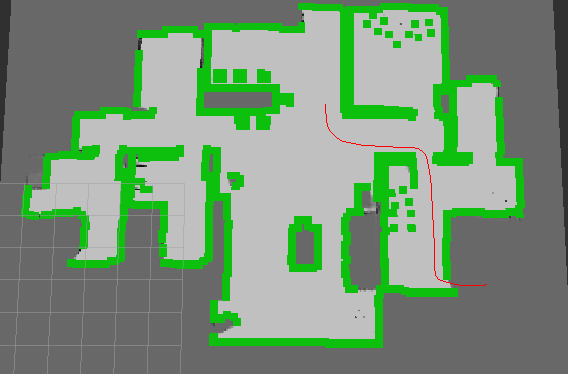
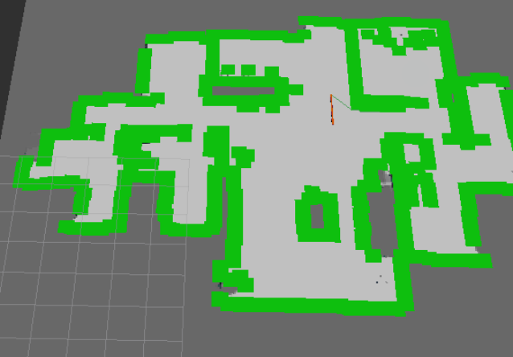
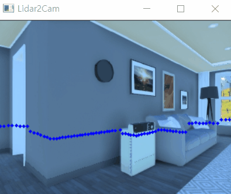
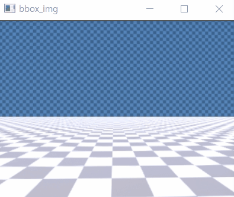

# SSAFY 4th 특화 프로젝트 IOT (sub2)

> ros2를 활용한 프로젝트


#### 제작 기간

> 21.03.08 ~ 21.03.19 (2주)


#### 참여 인원

> 5명

| 역할           | 이름   |
| -------------- | ------ |
| 팀장, 판단제어 | 빈준호 |
| 판단제어       | 문진환 |
| 판단제어       | 최진영 |
| 인지           | 윤승환 |
| 인지           | 윤건상 |


---

## 📂프로젝트 구조

```
\---sub2
    |   .gitignore
    |   README.md
    |
    +---catkin_ws
    |   +---build
    |   +---install
    |   +---log
    |   \---src
    |       +---ssafy_bridge
    |       +---ssafy_msgs
    |       \---sub2
    |           |   package.xml
    |           |   setup.cfg
    |           |   setup.py
    |           |
    |           +---map
    |			+---path
    |           +---resource
    |           +---sub2
    |           |       a_star.py
    |           |       a_star_local_path.py
    |           |       ex_calib.py
    |           |       human_detector.py
    |           |       load_map.py
    |           |       make_path.py
    |           |       odom.py
    |           |       path_pub.py
    |           |       path_tracking.py
    |           |       seg_binarizer.py
    |           |       utils.py
    |           |       __init__.py
    |           |
    |           \---test
    \---documents
```


------


## 📜 노드 설명

### [Req1. Odometry를 이용한 상대경로 생성 및 경로 추종](https://www.notion.so/da9e53ec922c46ffa81f212dc066b99f)

#### Odometry / IMU

- 주행기록계와 관성센서로 상대 위치와 각도 파악


#### 상대 경로 생성

- 상대 위치에 따른 이동경로로 이동경로 저장


- 생성된 경로



#### 경로 읽어오기 및 경로 추종 (Follow the carrot)

- 경로를 따라 이동
- 어느 위치를 목표로 정할 지, 어떻게 이동을 할 지 정함


---

### Req2. 맵 기반 절대경로 생성 및 경로 추종

#### 맵 읽어오기

- 맵 파일을 가져와서 장애물 기준으로 전방 2칸을 초록색으로 칠해주기



#### 최단경로 탐색 및 경로 추종

- a_star 알고리즘을 활용해 최단 거리로 가는 경로는 어떻게 될 지 찾음


---

### Req3. 인지 프로젝트

#### [Ex_calib](https://www.notion.so/ex_calib-3e81631ec6ab47e2b4bab1b624d2f833)

: ex_calib 노드는 터틀봇에 설치 된 2d 라이다 센서와 카메라의 위치 및 자세를 파악해서 카메라로 찍은 이미지에 라이다 포인트들을 정사영 시키는 노드입니다.



#### [Human_detector](https://www.notion.so/human_detector-4cb364f8127c40faae9718cb6ef2b5f1)

: 카메라 데이터에서 사람을 구분한 후 테두리를 데이터를 만들기 위한 노드입니다.



#### [Seq_binarizer](https://www.notion.so/seg_binarizer-d67da8fcebd04a70813f3f56175f9afd)

: 시뮬레이터 환경으로 부터 Segmentation image를 받아 각 물체마다의 색을 기준으로 구별하여 bounding-box를 찾아 이미지에 입히는 작업입니다. - (tf_detector 를 활용해 )


---


